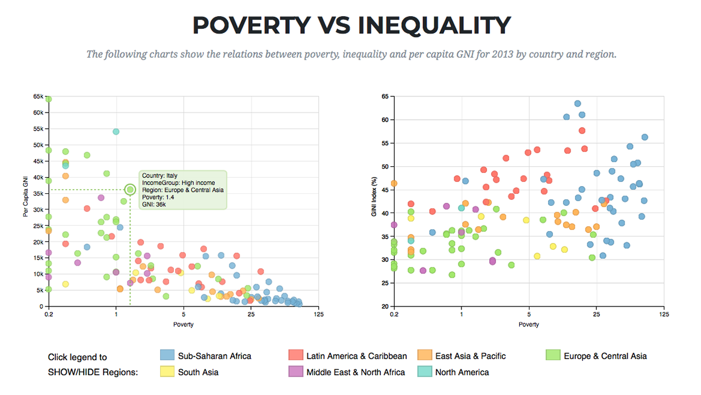
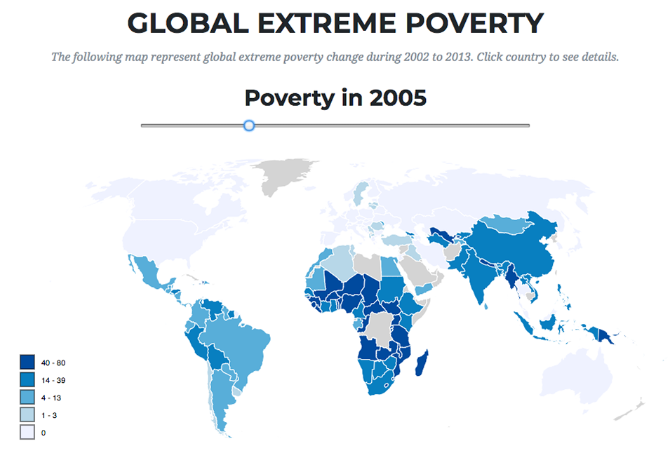
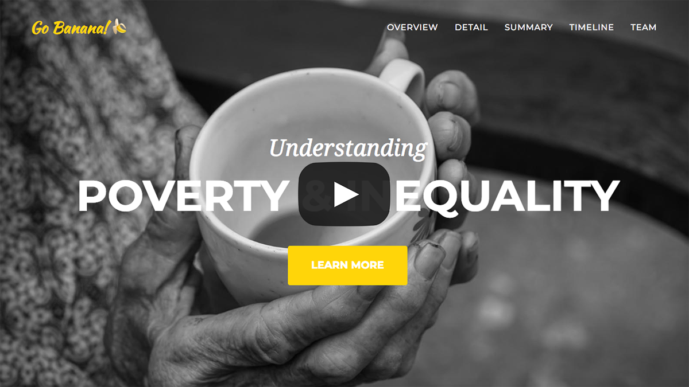

# Understanding Poverty & Inequality

A comprehensive research focused on measuring and explaining trends in poverty, inequality and economics. Using several data analysis and visualization tools.

## Resources

* [GoBanana.com](http://go_banana.sorabix.com/) - Research homepage
* [Report.pdf](Report.pdf) - Documentation

## Screenshots

## Video Demo

## Developers (Go Banana! Team)

* **Soravis Taekasem** - Data Analysis & Web Development
* **Nestor Diaz** - Data Wrangling & Charts Design
* **Wendi Ma** - Documentation

## Data Souces

* [UNdata](http://data.un.org) - Internet-based UN statistical data service
* [World Bank](https://data.worldbank.org) - Global development open data